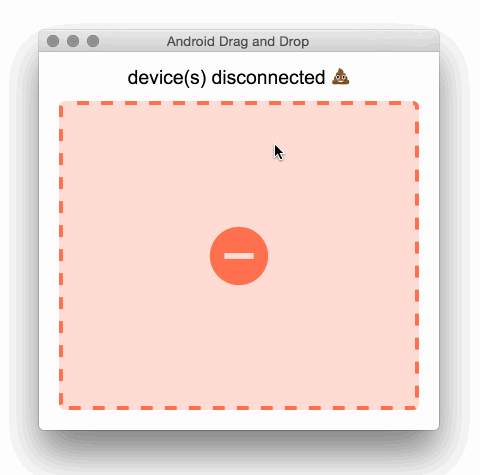

android-drag-and-drop
=========
[](https://travis-ci.org/rickycodes/android-drag-and-drop/) 
[](http://standardjs.com/) 



A proof-of-concept electron app for sending files to your android device

You'll need a working adb (Android Debug Bridge)
```
$ which adb
/Users/ricky/Library/Android/sdk/platform-tools/adb
```
(tested with Android Debug Bridge version 1.0.32)

### Requirements
* node
* adb

### License
Copyright (c) 2016 Ricky Miller (@rickycodes).

Released under the [MIT license](https://tldrlegal.com/license/mit-license).
