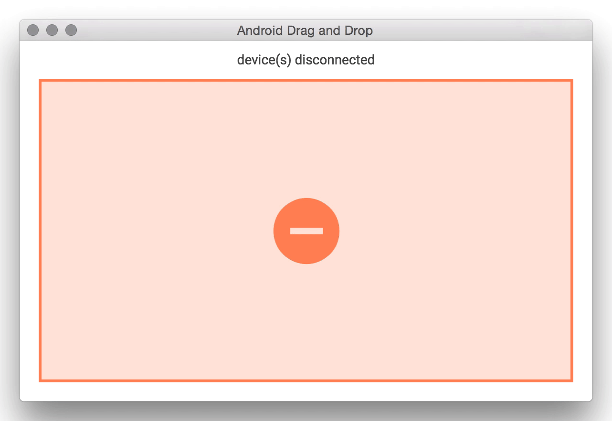

android-drag-and-drop
=========

[](https://greenkeeper.io/)
[](https://travis-ci.org/rickycodes/android-drag-and-drop/) 
[](http://standardjs.com/) 



A proof-of-concept electron app for sending files to your android device's `/sdcard/`

You'll need a working adb (Android Debug Bridge) as this is simply a UI that wraps adb device commands

```
$ which adb
/Users/.../Library/Android/sdk/platform-tools/adb
```
:ok_hand:

(tested on OSX with Android Debug Bridge version 1.0.32)

### Requirements
* node
* npm
* adb

## Install

* clone this repo
* from the cloned repo directory, install dependencies: `npm install`

## Running

* `npm run start`

## Tests

* `npm run test`

### License
Copyright (c) 2016 Ricky Miller (@rickycodes).

Released under the [MIT license](https://tldrlegal.com/license/mit-license).
